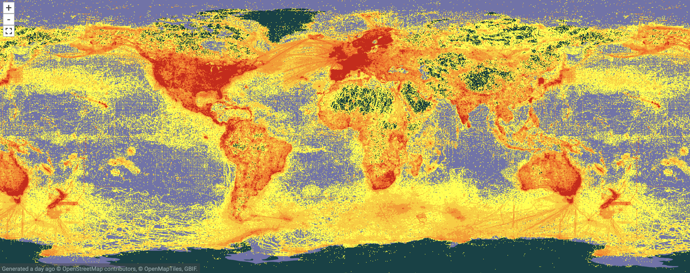
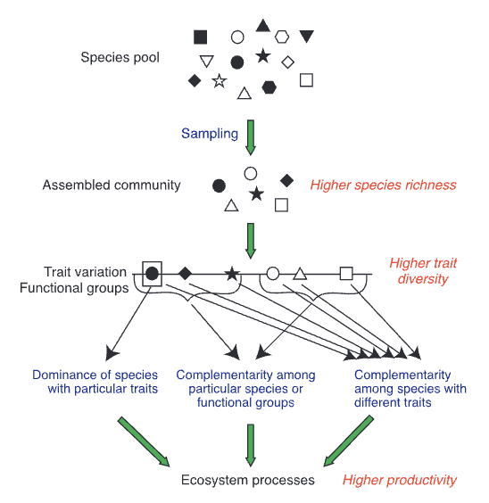

```{r setup, message=FALSE, warning=FALSE, include=FALSE}
knitr::opts_chunk$set(include = T, warning=F, message=F)
# knitr::opts_knit$set(root.dir = "..")
knitr::opts_chunk$set(error = TRUE)
```

# Tutorial Overview 
Biodiversity is a hot topic in the fact of unprecedented global change in the 21st century. With a publicly available dataset, [from the Turkey Lakes Watershed](https://open.canada.ca/data/en/dataset/f9e1595d-27bb-4a6a-b94d-6b9bed7db263), we demonstrate how to quantify biodiversity quantitatively and visually using `R`.


# Learning objectives
Utilizing historical data from a freshwater lake ecosystem, by the end of this tutorial you will be able to:

1. Identify, calculate, and implement commonly used metrics to quantify biodiversity 
2. Understand and create figures uses to display biodiversity data 
3. Apply this concepts to other aspects of the dataset used in this tutorial




Ecologists are often interested in the effects of perturbations (e.g. fires, logging, flooding or pollution) on biodiversity, which can yield information and context for ecosystem health. 
However, boiling biodiversity down to a single metric can be difficult and incomplete depending on the goal. 
With the help of the Turkey lake dataset of benthic invertebrates, we will present you with a number of common metrics to assess biodiversity, their meaning, and how they can be visualized with the help of Rank-Abundance curves. 

You will then have the option to learn to calculate biodiversity metrics yourself using an R package called codyn.

# Why biodiversity matters 





In an ever-changing world, we are often concerned with how organisms will be able to cope with disturbances and increasingly, global climate change. 
Biodiversity is the variety of life at all levels, from genes to ecosystems. 
Not only is biodiversity important for ecosystems to function properly, it is also an important buffer to withstanding changing environments. When there is high biodiversity, there is a higher chance of some organisms surviving ecosystems that are changing due to disturbance or climate change. 
Biodiversity therefore increases the resiliency of these ecosystems and the likelihood that they will be able to persist beyond this change.


# Types of data typically collected

Biodiversity is a broad term, and can be difficult to quantify. Biologists have created several standard measures of biodiversity that convey different information about ecosystems and the species living there. 


Often times, biologists interested in collecting biodiversity data collect a standard set of responses. These often include:

1. The different kinds of species in a given area or environment 
2. The number of individuals of each species (abundance)
3. Information about the area itself (i.e. habitat type, weather conditions, etc.)
4. If the work involves an setting up an experiment, collecting the control vs. experimental groups as well as metrics for replication and statistical power
5. The time frame over which the data were collected


# Real-world biodiversity data

The Turkey Lakes watershed is located in Ontario, Canada, approximately 50 km North of Sault Ste. Marie. 
It is 10 km^2^ in area and contains a chain of 4 lakes. The Turkey Lakes Watershed Study (see map) is an initiative by several agencies of the government of Canada, initially designed to study the effects of acid rain on forest ecosystems.
From 1995 to 2009, scientists collected, identified and counted benthic invertebrates from various stream beds around the Turkey Lakes catchment. 

```{r include=T, message=FALSE, warning=FALSE}
pacman::p_load(leaflet)

leaflet() %>%
  addTiles() %>%  # Add default OpenStreetMap map tiles
  addMarkers(lng=-84.4110, lat=47.0515, popup="Turkey Lakes") %>%
  setView(lng=-84.4110, lat=47.0515, zoom=2)
```
Figure 2. Interactive map of the Turkey Lakes study site


Benthic invertebrates are small, often microscopic organisms (see Fig. 1), but form an important link between aquatic and terrestrial habitats. 
They can decompose terrestrial matter such as leaves, or consume periphyton (algae and cyanobacteria) growing on rocks within their streams.
Benthic invertebrates can be a food source for aquatic animals, like small fish, or terrestrial animals such as birds.
An experiment was conducted in 1997 where certain sampling sites experienced different levels of logging intensity.
Due to their interaction with the terrestrial realm, we can hypothesize that the biodiversity of benthic invertebrate communities might be affected by logging.


 

## Data collection and structure

These data are from the Turkey Lakes watershed experiment. This dataset contains the abundances of benthic invertebrate species measured in the May and June from 1995 to 2001. They recorded the type and number of invertebrates in an area of the stream, with 10 replicates per sampling event. These forests next to these streams were logged in 1997 with varying harvest intensities, with low, medium, and high intensity harvest and a control stream with no forest harvest. First, we will subset the data, clen an process it in order to visualize and compare Rank-Abundance curves (RACs). Later in the tutorial, we will using the subsetted data with the `codyn` package to analyze the diversity of these benthic invertebrates over time. 

## Downloading and tidying the data

The data "TWL_invertebrateDensity.csv" from the [Government of Canada "Open Government" Portal on the "Turkey Lakes Watershed" page](https://open.canada.ca/data/dataset/576f1b52-3fce-497e-8e4c-0899acfdca1f). 
We can download and save the data as a data frame object using the following command:

```{r}
df.read = read.csv(file="https://ftp.maps.canada.ca/pub//nrcan_rncan/Forests_Foret/TLW/TLW_invertebrateDensity.csv")
```


First, in order to quantify biodiverisy, we will convert the species densities reported in the dataset to the raw counts (i.e. abundances) to obtain whole numbers of individuals.

```{r}
library(dplyr)
df.count = 
  df.read %>% 
  # Convert from wide to long format to simplify the operation
  tidyr::pivot_longer( 
    "Aeshna":"Trichoptera", 
    names_to = "Species", 
    values_to = "Density" ) %>%
  mutate(
    # Densities to counts
    Count = Density * 0.33, 
    Count = tidyr::replace_na(Count, 0) # Replace NAs with 0.
    )
```

# Quantifying biodiversity with real data

To explore these different diversity metrics and how they are calculated, we have subsetted data from the Turkey Lakes dataset across 4 years and 7 unique species  to look at how diversity changes over time.

```{r panelset, echo=FALSE, include=FALSE}
xaringanExtra::use_panelset()
```

# Ways to calculate diversity {.panelset}

There are several different ways to analyse and understand changes in community composition, or the relative abundances of all taxa in a community. Each of these metrics allow us to look at different aspects of the biodiversity data we collect.


1. ***Species richness*** quantifies the number of different species in a community.
2. The ***Shannon-Weiner Index*** estimates species diversity by taking into account the number of species living in a habitat (richness) and their relative abundance (evenness).
3. ***Simpson's Diversity Index*** also takes into account species richness and evenness, but puts more emphasis on rare species. 
4. The ***Evenness Index*** assesses the evenness of the abundances of each species. 


::::: {.panelset}

::: {.panel}

## *Species richness* {.panel-name}

Perhaps the simplest measure of biodiversity is species richness ($S$). 

The equation for species richness is:

$S = \sum_{i=1}^{S}p_i^o$

$p_i^o$ represents the proportion of individuals of species $i$, taking the sum across each of these species


**Step 1:** Count the number of unique species recorded in that year. Then you can look at how the number of different species in a community changes over time.

**Interpretation:** A higher number means there are more species, and therefore species richness is higher.

```{r, message=FALSE, warning=FALSE}
pacman::p_load(codyn, kableExtra)
#table just showing the number of unique species
richness_table <- df.count %>%
  filter(year %in% c(1995, 1997, 2001, 2009)) %>%
  group_by(year) %>%
  summarise(richness=length(unique(Species)))
#we should probably make this into a nice looking kable?
kable(richness_table, col.names=c("Year", "Richness"), align="c")%>%
  kable_classic(full_width = F, html_font = "Cambria")
```

We can see in this table that across years, the number of species in the same area did not fluctuate, however, this does not tell us how the abundances of each species changed.

:::

::: {.panel}

## Shannon-Wiener Index (H') {.panel-name}

Another metric we can use to analyze biodiversity is the Shannon-Wiener Index ($H$), which indexes across the sum of all relative proportions of species richness's with an additional logarithmic transformation. This equation uses both the number of species in a specific area (richness) and relative abundance (evenness). 

The equation for the Shannon-Weiner Index is:

$H' = - \sum_{i=1}^{S}p_ilnp_i$


**Step 1:** Calculate $p_i$, which is the proportion of $i$th individuals in the community.
$p_i = n_i/N$

Where $n_i$ is the number of individuals in the ith species and and $N$ is the total number of individuals in the community.

**Step 2:** Multiply the proportion of each species ($p_i$) by the logarithm of the proportion ($lnp_i$)

**Step 3:** Sum each of these values for each species.

**Step 5:** Multiply the sum by -1.

**Interpretation:** The minimum value of the Shannon's diversity index is 0, which means that there is no diversity (i.e. only one species is found in that habitat). The values increase as the number of species increase, and is maximized at a given number of species when is an equal abundance of each species.

```{r}

shannon <-df.count %>%
  filter(year %in% c(1995, 1997, 2001, 2009)) %>%
    group_by(year, Species) %>%
    summarise(sum=sum(Count)) %>%
    mutate(prop = sum/sum(sum),
    shannon= sum(prop/log(prop))) %>%
    summarise(shannon = mean(shannon))

kable(shannon, col.names=c("Year", "Shannon's Index"), align="c")%>%
  kable_classic(full_width = F, html_font = "Cambria")
```

We can see that the Shannon diversity increases over time, though it is negative throughout the nearly 2 decades of data collection.

:::

::: {.panel}

## Simpson's Index (D) {.panel-name}

Another metric we can use to analyse biodiversity in the Simpson's index ($D$) which indexes across the sum of all relative proportions of species's richness with an additional square power transformation. Though very similar to the calculation in the Shannon-Wiener Index, the Simpson index is more focused on dominance of species as it highlights the proportion of species in a sample.

The equation for Simpson's diversity is:

$D = 1-(\sum n_i(n_i-1))/N(N-1))$

Where $n$ is the number of individuals of the ith species and $N$ is the total number of individuals in the community.


**Step 1:** Multiply the number of individuals of a given species ($n_i$) by ($n_i-1$).

**Step 2** Multiply the total number of individuals in the community ($N$) by ($N-1$).

**Step 3:** Divide the number from step 1 by the number from step 2.

**Step 4:** Once you have a number from step 3 for each species in the community, sum all of these together.

**Interpretation:** The higher the value of $D$, the greater the diversity in the community. An index close to 1 means that there are several species in the community, and the population proportion of species is even.

```{r}
simpson<-  df.count %>%
  filter(year %in% c(1995, 1997, 2001, 2009)) %>%
    group_by(year, Species) %>%
    summarise(sum=sum(Count)) %>%
    mutate(prop = sum/sum(sum),
    simpson = sum((prop)^2)) %>%
    summarise(simpson = mean(simpson))

kable(simpson, col.names=c("Year", "Simpson's Index"), align="c")%>%
  kable_classic(full_width = F, html_font = "Cambria")
```

The Simpson index increases over time and then decreases, which tells us that by this measure, biodiversity is not stable and on a downward trend.

:::

::: {.panel}

## Evenness Index (E) {.panel-name}

Additionally, we can think about the evenness of species across a given area. Evenness is a metric for assessing species dominance. If evenness is high, it means most species are of equal dominance. If evenness if low, it means some species are more dominant (i.e. have higher abundance) than others. Evenness is maximized when all species have equal abundances.

The equation for species evenness is:

$E = H / ln(S)$


**Step 1:** Divide the value of the Shannon-Wiener index ($H$) by the species richness ($S$).

**Interpretation:** Values closer to one signify more evenness and values closer to 0 signify lower evenness.

```{r}
evenness<- df.count %>%
filter(year %in% c(1995, 1997, 2001, 2009)) %>%
group_by(year, Species) %>%
    summarise(sum=sum(Count)) %>%
    mutate(richness=93, 
           prop = sum/sum(sum),
    shannon= sum(prop/log(prop)),
    evenness = shannon/log(richness)) %>%
    summarise(evenness = mean(evenness))

kable(evenness, col.names=c("Year", "Evenness"), align="c")%>%
  kable_classic(full_width = F, html_font = "Cambria")
```

We can see that evenness is low from the start and slightly increases over time, suggesting that species abundances are becoming more even.

:::

:::::


# Visualizing species diversity

Apart from calculating biodiversity using the metrics above, visualizing differences using graphs is another tool we have. One way to visualize biodiversity data is to make a Rank-Abundance Curve (RAC). On the y-axis we have the species (numbered), and on the y axis we have the abundance. The plots are organized from high to low abundance. Using RACs, we can visualize the change in relative abundance and species dominance over time.

Here, we have selected 7 species across 2 years from the Turkey Lakes dataset to make a simple RAC

```{r}

pacman::p_load(tidyverse, patchwork)

subset <- df.count %>%
  filter(Species %in% c("Chironomidae", "Prosimulium", "Baetis", "Heterocloeon", "Chelifera", "Leuctra")) %>%
  filter(year %in% c(1995, 1997, 2001, 2009)) %>%
  group_by(year, Species) %>%
  summarise(sum=sum(Count))

#2007
a<- subset %>%
  filter(year==1995) %>%
ggplot(aes(x=reorder(Species, -sum), y=sum, shape=Species, colour=Species))+
  geom_point(size=4)+
  scale_colour_viridis_d()+
  ggtitle("1995")+
  labs(x="Species", y="Abundance")+
  theme_classic()+
  #theme(legend.position="none")+
  labs(x="Species", y="Abundance", color="Species")

#2007
b<- subset %>%
  filter(year==2001) %>%
ggplot(aes(x=reorder(Species, -sum), y=sum, shape=Species, colour=Species))+
  geom_point(size=4)+
  scale_colour_viridis_d()+
  ggtitle("2001")+
  labs(x="Species", y="Abundance")+
  theme_classic()+
  #theme(legend.position="none")+
  labs(x="Species", y="Abundance", color="Species")

a / b
```

We can see here between 1995 and 2001 in our benthic community, there were small differences in absolute counts, with the most abundant species (Chrironomidae) decreasing ~5000 in abundance of individuals, but still remaining the most abundance species overall across both years. However, Baetis was the 2nd most abundant species in 1995, but dropped to 5th most abundant by 2001.


## Rank abundance curves with Turkey lakes invertebrate data {.panelset} 


::::: {.panelset}


::: {.panel}

### Additional data wrangling {.panel-name}

The dataset spans multiple years, months, and catchments within the Turkey lakes watershed and includes densities for a wide array of invertebrate species across multiple replicate sites. You can visualize Rank Abundances for any subset of the dataset using [the following Shiny App](https://ekatko1.shinyapps.io/TurkeyLakesInverts/).

Using information obtained from the [metadata of this dataset](https://ftp.maps.canada.ca/pub//nrcan_rncan/Forests_Foret/TLW/TLW_invertebrate_metaEN.csv), we can add some interesting details to the data (for at least a few catchments and years). For the purposes of this portion of the tutorial, we also select a different subset of the data to work with.

```{r}
## Different catchments had different logging intensities
treatment = tibble(catchment =             c("34M",  "34U",    "34L"),
                   `Logging Intensity`   = c("none", "medium", "high"))

## Logging happened in 1997
yearAnnot = tibble(
  year = 1995:2001,
  trt  = c( rep("pre-logging", 2), "logging", rep("post-logging", 4))
)

df.subset =  
  df.count %>%
    right_join(treatment) %>%
    right_join(yearAnnot) %>%
  filter(month %in% c("june", "may"))
```

Then, we will clean up the data by removing any species whose count is zero across all the different sites and years. 

```{r}
## Find species that have 0 abundance across all sites and years.
NA_sp = df.subset %>%
  group_by(Species) %>%
  summarize(Count = sum(Count, na.rm=T)) %>%
  filter(Count==0) %>%
  select(Species)

## Remove those species from the dataset
df.clean = df.subset %>% 
  anti_join(NA_sp)

```

:::

::: {.panel}

### Summarise Data {.panel-name}

Let's start by looking at catchment "34L", which saw high levels of deforestation in june of 1998, the year following the logging event.

```{r}
df.subset1 <- df.subset %>% 
  filter(catchment == "34L", 
         year      == 1998,
         month     == "june")
```

Next, we can sum the count data over all the replicate sites within the catchment to obtain a total count within the catchment. 

```{r}
df.raw.summary1 = 
  df.subset1 %>%
  group_by(Species) %>%
  summarise(
    TotalCount = sum(Count))
```

Then, we order the species from most abundant to least abundant.

```{r}
df.ordered.summary1 = 
  df.raw.summary1 %>%
  arrange(desc(TotalCount)) 
```

Finally, we assign a rank to the species (rank 1 = the most abundant species) and filter out any species which are not actually present in this catchment.

```{r}
df.summary1 = 
  df.ordered.summary1 %>%            
  mutate( Rank = seq_along(Species) ) %>%  
  # Keep only species with abundances greater than zero.
  filter(TotalCount > 0)                   
```

:::

::: {.panel}

### Plot the data {.panel-name}

We make a plot to represent the data. Note that we need to use the `stats::reorder()` function to get the species on the x-axis in the correct order:

```{r}
library(ggplot2)
plot1 = 
  df.summary1 %>%
  ggplot(aes(x=reorder(Species, -1*TotalCount), 
             y=TotalCount)) + 
  geom_col() +
  xlab("Taxon") +
  ylab("Total count (sum of replicates)") + 
  theme_classic(base_size=16) +  # Aesthetic
  theme(axis.text.x = element_text(face="italic", size=9, angle=90)) # Use italics for species names
plot1
```

As you can see, Rank-Abundance Curves (RACs) in nature are rarely as evenly distributed as the simulated data. 
There is often few highly abundant species and many very rare species. 
As a result, a log transform is frequently applied to the y-axis. 
Additionally, when analyzing RACs, the focus is on the shape of the curve, not on the species names. 
As a result, we can substitute the species name with it's rank. 
This is where the term *rank*-abundance comes from. 
This also has the added benefit of simplifying the code:

```{r}
df.summary1 %>%
  ggplot(aes(x=Rank, y=TotalCount)) + 
  geom_col() +
  xlab("Rank") +
  scale_y_log10() + 
  ylab("log Total count") + 
  theme_classic(base_size=16) # Aesthetic
``` 


:::

::: {.panel}
### Comparing RACs {.panel-name}

Instead of using bars to represent abundances, we can simply use lines to trace the distribution. 
This allows us to compare multiple distributions. 
First, let's compare the different replicates (i.e., sites) within a single catchment area.

```{r}
df.subset1 %>%
  group_by(replicate) %>% 
  # Order by rank, for each catchment (.by_group=T)
  arrange(desc(Count), .by_group = T) %>%
  mutate( Rank = seq_along(Species) ) %>%  
  # Keep only species with abundances greater than zero.
  filter(Count > 0) %>%
  # Line Plot
  ggplot(aes(x=Rank, y=Count, color=as.factor(replicate))) + 
    xlab("Rank") + 
    ylab("log Count") + 
    geom_line(size=2) + 
    scale_y_log10() +
    # Some aesthetic choices:
    theme_classic(base_size=16) +
    scale_color_brewer(name = "Site", palette = "Paired")
  
```
Notice that there is some variation in the shape and the "eveness" (i.e., slope) of the different RACs. 
Furthermore, the highest rank in the summary bar plot was 40, whereas the single site with the highest rank has only 29 species.
This demonstrates that the more we sample, the more rare species we can find. 

Alternatively, we can compare RACs from three different catchments, each of which has a different logging intensity. 
Note that all catchments have 10 replicate sites, which allows us to sum across replicates.
Also note that differences in sampling can affect the shape of the RACs, which means that one has to be careful to account for sampling effort when comparing RACs from differnt studies.

```{r}
plot = 
  df.subset %>% 
  # Subset
  filter( year      == 1998,
          month     == "june") %>%
  # Summarise across replicates
  group_by(`Logging Intensity`, catchment, Species) %>%
  summarise(TotalCount=sum(Count)) %>% 
  # Order by rank, for each catchment (.by_group=T)
  group_by(catchment, `Logging Intensity`) %>%
    arrange(desc(TotalCount), .by_group = T) %>%
    mutate( Rank = seq_along(Species) ) %>%
  # Keep only species with abundances greater than zero.
  filter(TotalCount > 0) %>%
  # Line Plot
  ggplot(aes(x=Rank, y=TotalCount, color=`Logging Intensity`)) + 
    xlab("Rank") + 
    ylab("log Total count") + 
    geom_line(aes(size=`Logging Intensity`)) + 
    scale_y_log10() +
    # Some aesthetic choices:
    scale_size_manual(values=c(2.5, 2, 1.5)) +
    theme_classic(base_size=16) +
    scale_color_brewer(palette="Dark2") + 
    theme(legend.position = c(0.87,0.87))
plot
  
```

Notice that we can rapidly see that the catchment with high intensity logging had the highest species richness (highest maximum rank). 
The catchment that we logged with medium intensity also appears to have a less "even" RAC compared to the other two. 
In other words, the slope is slightly steeper for the "medium" intensity site than for the "high" and "none" (no logging) catchments.
Of course, many more sites over several years need to be compared in order to make any generalizable claims about the effects of logging on invertebrate biodiversity in the Turkey Lakes area.

Furthermore, several models have been developed to understand rank-abundance curves (e.g. log-normal, broken stick model). 
The `radfit` function from the `vegan` `R` package allows fitting of these different curve models (see https://search.r-project.org/CRAN/refmans/vegan/html/radfit.html)

:::

:::::

# `codyn` tutorial

Now that we have calculated different biodiversity metrics and rank abundance curves by hand, we can also use existing functions in the `R` packahe `codyn` to quantify and visualizing changes in biodiversity with the Turkey Lakes datset.


```{r setup2, include=FALSE, message=FALSE, warning=FALSE}
knitr::opts_chunk$set(include = T, warning=F, message=F, echo=T)
knitr::opts_knit$set(root.dir = "..")
```

## Load Data and Packages

We will be using the `codyn` package for this tutorial. We will also use `ggplot2` and `dplyr` for plotting and cleaning. First, we need to load these packages.

```{r, message=FALSE, warning=FALSE}
library(ggplot2)
library(codyn)
library(dplyr)
```

Load, subset and clean the data (see "Rank abundance curves with Turkey lakes invertebrate data" above for details) :

```{r}
data  <- 
  read.csv(file="https://ftp.maps.canada.ca/pub//nrcan_rncan/Forests_Foret/TLW/TLW_invertebrateDensity.csv") %>%
  pivot_longer( "Aeshna":"Trichoptera", names_to = "species", values_to = "density") %>%
  mutate(abundance = density * 0.33, 
         treatment = case_when(catchment %in% c("33") ~ "low", 
                               catchment %in% c("34U") ~ "medium", 
                               catchment %in% c("34L") ~ "high", 
                               catchment %in% c("34M") ~ "control", 
                               TRUE ~ "natural"), 
         date_yr_m = zoo::as.yearmon(paste0(year,month), "%Y %b")) %>%
  drop_na(abundance) %>% 
  filter(year >= 1995, 
         year <= 2001, 
         # stringr::str_starts(catchment, stringr::fixed("34")), 
         month %in% c("june", "may"))

# summing over treatments sampling events
data_sum<- data %>%
  filter(treatment  %in% c("low", "medium", "high", "control")) %>% 
  group_by(year, species, treatment, replicate) %>%
  summarise(abundance = sum(abundance))

```


For many functions, the `codyn` package can only look at data from one stream at a time. So first we will separate each stream into it's own data frame.

```{r, message=FALSE, warning=FALSE}
# high intensity logging treatment
subset_codyn_high <- data %>%
  filter(treatment == "high")
# medium intensity logging treatment
subset_codyn_med <- data %>%
  filter(treatment == "medium")
# low intensity logging treatment
subset_codyn_low <- data %>%
  filter(treatment == "low") 
# control stream (no logging)
subset_codyn_ctrl <- data %>%
  filter(treatment=="control")
```


## Using the `codyn` package to analyze diversity data over time {.panelset}

Ecologists are often interested in how diversity changes over time in one place. This is particularly interesting when you are looking at how species diversity responds to environmental change. This environmental change can be a single disturbance event such as a forest fire or more long-term change such as temperature increases due to climate change. 


The Turkey Lakes dataset provides us with an opportunity to look at how the diversity of benthic invertebrates changes over time and in response to logging, given that areas of the river were subjected to different levels of logging. We can compare the diversity of different streams with different logging intensities and we can also compare the diversity of streams.

The `codyn` package allows us to analyze the change in biodiversity over time using different metrics.

## Using `community_structure()`

`community_structure()` is a function in the package `codyn` that calculates species richness and evenness. 

::::: {.panelset}

::: {.panel}

## Subset data

Let's take a look at the high intensity logging stream data.

```{r}
head(subset_codyn_high)
```

As you can see, there is a column for year, species, replicate, and abundance.

:::


::: {.panel}

## Calculations with `community_structure()` {.panel-name}
For example, we can use `community_structure()` to look at the change in species richness and evenness over time in one of the Turkey Lake streams. We will choose the stream with high logging intensity as an example. This function can only look at one stream at a time so make sure to subset out the stream that you are interested in.

The community structure function has five arguments. 
1. `df` is where you put in the data frame of interest, in our case `subset_codyn_high`. 
2. The `time.var` argument is where you put in your time variable (`year`)
3. The `abundance.var` argument is where you put the column that holds the abundance variable (`abundance`).
4. The `replicate.var` argument holds the column with the replicates (`replicate`)
5. The `metric` argument allows you to specify the metric of evenness that you want the function to calculate. There are three possible metrics: `Evar`, `SimpsonEvenness`, and `EQ`, which all calculate evenness in different ways. We will use Simpson's Evenness in this tutorial. 

Remember, if you ever need a refresher on the syntax you can type `?community_structure` into the R script.

```{r class.source = 'fold-show'}
richness_high<-community_structure(df=subset_codyn_high, time.var="year", abundance.var="abundance", replicate.var="replicate", metric="SimpsonEvenness")
```

We can take a look at the output.

```{r}
head(richness_high)
```

As you can see, this returns a data frame with the year, replicate, richness calculation, and evenness measure. It calculates richness and evenness separately for each replicate sample in the stream, so we have a measure of variability within samples as well as variability across years. 

:::

::: {.panel}

#### Plot species richness

We can plot this data frame to see the changes over time.

```{r}
pacman::p_load(png, grid)
img <- readPNG("logging.png")
g <- rasterGrob(img, interpolate=TRUE)


ggplot()+
  geom_vline(xintercept=1997, linetype=2, color="red", size=2)+
  geom_point(richness_high, mapping=aes(x=year, y=richness), alpha=0.5)+
  geom_pointrange(richness_high, mapping=aes(x=year, y=richness), size=2, stat="summary")+
  theme_classic()+
  labs(y="Species Richness", x="Year")+
   annotation_custom(g, xmin=1996.5, xmax=1997.5, ymin=20, ymax=30)
```
**Figure** Species richness of aquatic macroinvertebrates over time. Each point is a replicate.

Here is a plot of species richness, with a different value for each replicate. The red line is the year that the streams were logged. Do you see any change? Do you think there are any significant patterns? How does the variability between replicates compare to the variability between years?

:::

::: {.panel}

#### Plot species evenness

We can also plot species evenness over time.

```{r}

ggplot()+
  geom_vline(xintercept=1997, linetype=2, color="red", size=2)+
  geom_point(richness_high, mapping=aes(x=year, y=SimpsonEvenness), alpha=0.5)+
  geom_pointrange(richness_high, mapping=aes(x=year, y=SimpsonEvenness), size=2, stat="summary")+
  theme_classic()+
  labs(y="Species Richness", x="Year")+
   annotation_custom(g, xmin=1996.5, xmax=1997.5, ymin=0.57, ymax=0.75)
```
**Figure** Species evenness of aquatic macroinvertebrates over time. Each point is a replicate.

Do you see any patterns in the evenness between years?

:::

:::::

## Using `community_diversity()`

Species richness and evenness are very simple ways to look at species diversity. However, as you learned from the rank abundance curves, species have different abundances within the community, with some species having very high abundance and most species having low abundance. Species richness does not take into account the relative abundances of each species, which limits the inferences we can make. The Shannon-Weiner diversity metric does take into account these relative abundances when calculating the diversity of a community and allows us to make more meaningful inferences about how biodiversity is changing over time.


::::: {.panelset}

::: {.panel}

## Shannon diversity with `community_diversity()`

The `codyn` package allows you to calculate the Shannon diversity index for a single site over time using the `community_diversity()` function. We will again use the data from the stream with the high logging intensity. Luckily, this function has the exact same syntax as the `community_structure()` function! The only difference is that the options for the `metric` argument are `Shannon` and `InverseSimpson`.

 We will first use `Shannon`.

```{r class.source = 'fold-show'}
shannon_div_high<-
  community_diversity(
    df=subset_codyn_high, 
    time.var="year", 
    abundance.var="abundance", 
    replicate.var="replicate", 
    metric="Shannon")
```

Let's take a look at the output for this function.

```{r}
head(shannon_div_high)
```

You can see it gives us a data frame of `year`, `replicate`, and `Shannon`, which is our measure of Shannon diversity.

:::

::: {.panel}

## Plot Shannon's diversity

```{r}
ggplot()+
  geom_point(shannon_div_high, mapping=aes(x=year, y=Shannon))+
  theme_classic()+
  labs(y="Shannon Diversity", x="Year")+
  geom_vline(xintercept=1997, linetype=2, color="red")
```
**Figure** Shannon's diversity of aquatic macroinvertebrates over time. Each point is a replicate.


:::

::: {.panel} 

## Simpon's diversity with `community_diversity`

We can also use the same function to calculate Simpson's diversity by simply changing the `metric` argument to `InverseSimpson`. 

```{r class.source = 'fold-show'}
simpson_div_high <- 
  community_diversity(
    df=subset_codyn_high, 
    time.var="year", 
    abundance.var="abundance", 
    replicate.var="replicate", 
    metric="InverseSimpson")
```

We can look at the output.

```{r}
head(simpson_div_high)
```


:::

::: {.panel} 

## Plot Simpson's diversity

And then plot.

```{r}
ggplot()+
  geom_point(simpson_div_high, mapping=aes(x=year, y=InverseSimpson))+
  theme_classic()+
  labs(y="Simpson Diversity", x="Year")+
  geom_vline(xintercept=1997, linetype=2, color="red")
```

**Figure** Simpson's diversity of aquatic macroinvertebrates over time. Each point is a replicate.

How do these patterns compare to the patterns of Shannon's diversity over time? How do the values compare?

:::

:::::


## Activity
Calculate richness, evenness, and diversity using both the Shannon and Simpson indices for the streams with low intensity logging, high intensity logging, and no logging. The data for these streams are `subset_codyn_low`, `subset_codyn_high`, and `subset_codyn_ctrl`. Plot these indices. Do you see any patterns across years? How do these compare to the patterns in the high intensity logging stream?

# References 

I got the equations from this paper: DOI:10.1007/s10531-016-1261-0


